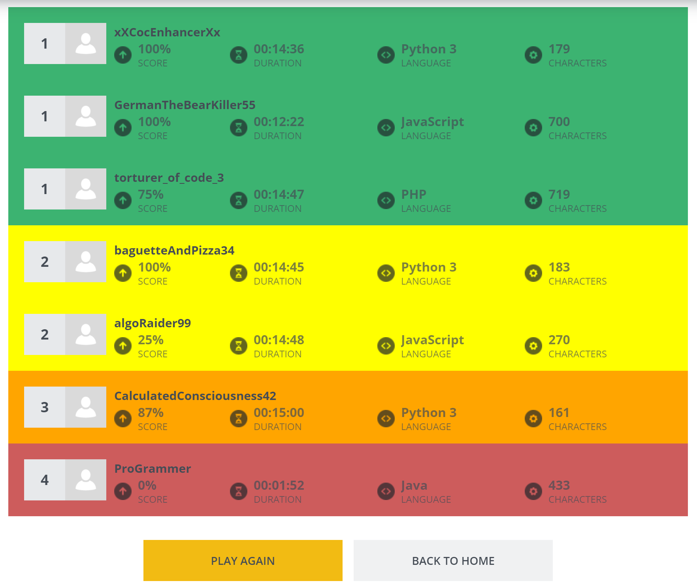
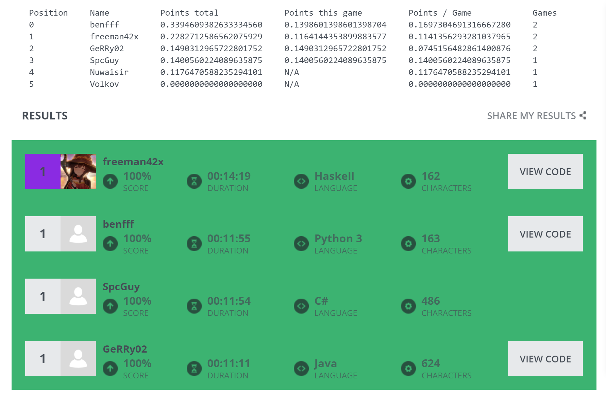
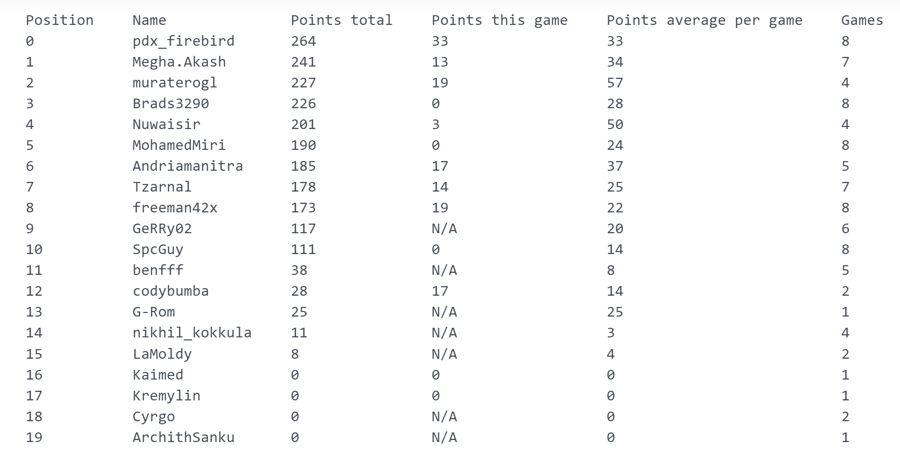

# CodinGame - Clash of Code enhancer userscript

Features:

* fair leaderboard points system - the verbosity of a programming language does not influence points gained in shortest mode clashes
* tournament leaderboard points persistent over multiple Clash of Code games
* color codes the vanilla leaderboard based on current game results: green for winners, yellow for 2nd position, orange for 3rd position or lower and red for 0% score, setting: enableVanillaLeaderboardStyling
* automatically shares code when clash ends, setting: automaticallyShareSolution
* when starting a new clash it closes the pop-up
* when starting a new clash it enables the automatic file sync extension: [CodinGame Sync](https://www.codingame.com/forum/t/codingame-sync-beta/614), setting: enableIdeSynchronization

Keyboard shortcuts

On leaderboard / clash report page:

- <kbd>Ctrl</kbd> + <kbd>m</kbd> to start new tournament - resets the points
- <kbd>Ctrl</kbd> + <kbd>i</kbd> to initiate a new clash

On creating a new private clash page:

- <kbd>Ctrl</kbd> + <kbd>Alt</kbd> + <kbd>0</kbd> deselect all languages
- <kbd>Ctrl</kbd> + <kbd>Alt</kbd> + <kbd>1</kbd> select all languages
- <kbd>Ctrl</kbd> + <kbd>Alt</kbd> + <kbd>2</kbd> select statically typed functional programming languages only
- <kbd>Ctrl</kbd> + <kbd>Alt</kbd> + <kbd>3</kbd> select dynamically typed programming languages only

How to install:

* install https://violentmonkey.github.io/ extension for your browser or equivalent user script browser extension
* load the userscript `userscript.user.js` in the extension: With violentmonkey you can do that by saving the raw `userscript.user.js` to your computer and then drag and dropping it in a browser tab

To change settings edit the SETTINGS object values in the source code.

Screenshots:

---

---

Contributing - if you wish to contribute, here is a list of features and bug fixes that are incoming. I recomend discussing with me before working on implementing or fixing something so that we do not overlap. The 2 lists bellow are priority queues and I work on them top down.

Features:

* tooltips that explain columns, points, etc.
* enhance the clash user interface: remove uneeded elements, fix tiling bugs, allow resizing of all sections, ... 
* position for each separate win category: average points position, wining streak position, etc.
* automatic link sharing to twitch via speechchat.com or twitch stream manager and to Discord possibly via having a Discord tab opened also
* the TTS voice is not kawaii enough
* add wordwrap to the solution view!!!!!!!!!!!!!!!!!!!!!!!
* best highlighting/column for: 100% win streak, different language streak, etc.
* green and red arrow if someone advances in the leaderboard
* notifications and permanent indicators for when other Clash of Code players are streaming
* start new tournament - tournament id
* tournament id dropdown - aggregate [1..n] tournaments
* publish user script
* force update keyboard shortcut
* shortcut for starting new public clash: Ctrl + Shift + i and document it
* change timer color as time remaining gets lower: green to red gradient
* use exponential scale for score
* get stars for 100% score solutions
* more columns to get best players based on different metrics
* more advanced statistics: ELO rating? how consistently well someone plays?
* automaticly invite people the user is following and twitch/discord share of the clash link
* submit on all tests passed for fastest modes
* display tournament round
* export all user script data and settings to file
* vote on quality, type safety, etc. via CoC integrated chat
* easy way to compare 2 or more solutions side-by-side
* save answers locally
* move css to external file: @resource
* reset local code file when starting new clash
* points explanation
* shortcut to obfuscate usernames and avatars
* cheating using: ruby -e"" should not give points
* other uses for the TTS hammer
* keyboard shortcut to focus view on leaderboard, current game results, etc.
* convert table to use angularjs? vue?
* sort by columns (use angularjs?)

Bugs:

* AleaJacta should have win streak of 1: https://www.codingame.com/clashofcode/clash/report/15689239b757aade61f4ebc9b3be09d7d3dc5da
* less than 100% should not be colored in green: https://www.codingame.com/clashofcode/clash/report/1553675e0fa94865764d79d18d51fae0e8dc6f5
* hook into AngularJS lifecycle to do proper updates which are currently bugged and not always happening. Use angularjs after reloadWithDebugInfo, see: https://github.com/Azkellas/cgenhancer/issues/2#issuecomment-763527122